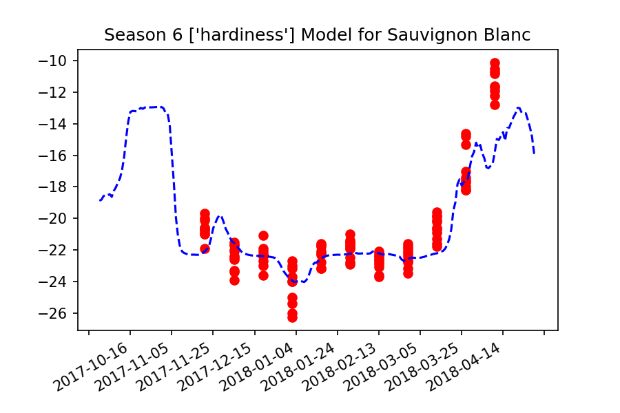
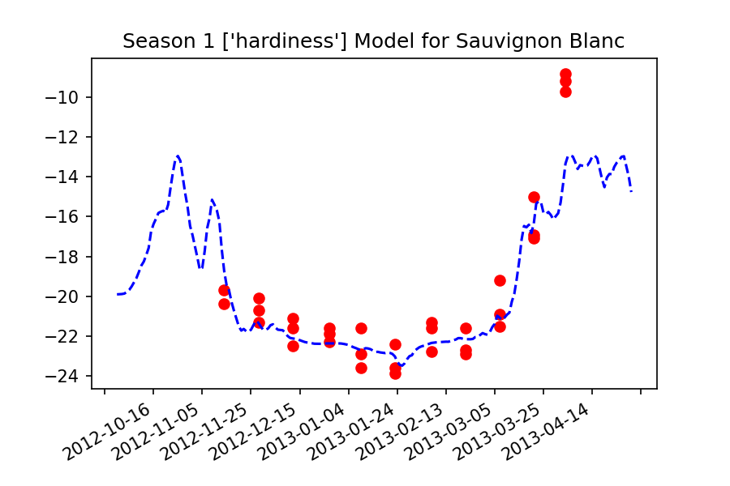

# Home for Grapevine Cold Hardiness Predicition
## Okanagan Valley, BC

# Description
Predicting grapevine cold hardiness in the Okanagan Valley, BC.


# ./scripts
* Stores all the python scripts which clean, manipulate, alter data in any form.
* Generally saves the data manipulations into ./data
* ```hardiness_cleaning_X.py``` run them in order to get the 'immutable' cleaned hardiness file
* ```hardiness_manipulation.py``` calculates the delta hardiness from ../data/data_and_weather.csv
* ```weather_manipulation.py``` summarizes data between sample dates into one statistic for each metric if any new inputs or parameters want to be tested, do it in here
* ```weather_manipulation_validation.png``` Did one set of the summary stats manually in excel to validate everything was working correctly. Probably doesn't need to be updated as this just proves the data_between_dates is working.

# ./data
* Data that was created from the ./scripts directory OR was inhereted by another source (cleaned Penticton weather)
* ``` hardiness_cleaned.csv ``` should be treated as immutable. Do not write to this file unless tested well in the '/scripts/hardiness_cleaning_X.py' files
* ``` model_inputs.csv ``` contains all the current weather parameters comparing to hardiness and the change in hardiness between timesteps
* ``` penticton_weather_data.csv ``` is the inhereted source for weather data from the Penticton Weather Station. TODO: clean the uncleaned penticton weather data to get wind and other metrics that were left out of this data
* ``` penticton_weather_data_v1.csv ``` used this for some reason in the interactive plot in ./viz so I decided to keep it instead of dealing with it :)

# ./viz
* ``` correlations.py ``` creates the correlation plots between weather parameters and hardiness 
* ``` weather_hardiness_interactive.py ``` interactive visualization for weather & hardiness. Could definitely be updated to make more useful. 
* Interesting Hardiness Comparisons:
- Chardonnay, Merlot, Pinot Gris - 2014 vs 2018 
- '' ,        '',       ''       - 2015 vs 2018
- 2018 and 2017 are more similar though

# ./bayesian
* Location for all future bayesian modeling

# ./ML

* SVR_sauv_blanc_all_sites.py
    - Trained SVR with an 'rbf' kernel
    - model tries to predict the true hardiness of a grapevine given the average temperature from the previous 14 days 
    - data was split into a test and train set
        - Test: Seasons 3 and 6 (2014-2015 and 2017-2018)
        - Train: Seasons 1, 2, 4, 5, 7
    - data is completely pooled by site 
    - model input is average maximum temperature of the previous 14 days
    
* SVR_sauv_blanc_oliver_east.py
    - Same model and setup as the SVR file above, but this was trained and tested on data only from Oliver, East

## SVR Results
### Validation Years



### Training Years



# Cleaning, Manipulation, etc. order

### To follow manipulation techniques & considerations or make changes:
I know it's still a bit spaghetty-y (??) but gotta have a trade off for dev time sometimes
1. start with the 'scripts/hardiness_cleaning_X.py' files to see how data is concatentated, cleaned, etc.
2. run 'scripts/weather_manipulation.py'
3. run 'scripts/hardiness_manipulation.py'

# Data Sources
## Environment Canada
Instructions for getting Penticton Weather Station Data: https://drive.google.com/drive/folders/160ZGld_zZrqju29GFk2PVAerIeVxKotn

Cygwin query: ``` for year in `seq 2012 2022`;do for month in `seq 1 1`;do wget --content-disposition "https://climate.weather.gc.ca/climate_data/bulk_data_e.html?format=csv&stationID=50269&Year=${year}&Month=${month}&Day=14&timeframe=2&submit= Download+Data" ;done;done ```


# Correlation Analyses


# Multicollinearity Checks
* See if independent variables have a pairwise correlation > 0.8 

# Approaches

## ML 

## Bayesian
